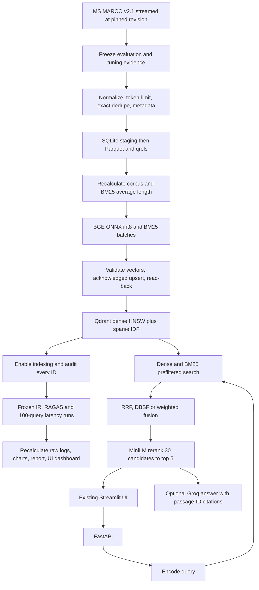

# PrecisionRAG

Retrieval over a reproducible MS MARCO QnA v2.1 subset: BGE-small dense embeddings, BM25, Qdrant HNSW, configurable fusion, MiniLM cross-encoder reranking, and the team's existing Streamlit frontend. CPU and optional NVIDIA CUDA model execution are supported; see [GPU setup](docs/gpu.md).

Built against `Problem Statement.pdf`, `eyaaduhcaam_PS1.pdf`, and all files in `Work Done till now/`. The supplied frontend is retained in that folder; backend modules and commands run from this repository root.

## Current verified state

- A real **100,000-passage** corpus has been downloaded and saved locally in `data/corpus.parquet` (~21 MB compressed).
- **100 evaluation queries + 50 disjoint tuning queries** are frozen, with 100% labelled-passage coverage. This sample's maximum BGE length is 372 tokens, so no passage required clipping.
- Real BGE/BM25/MiniLM inference, all fusion options, scoped search, upsert and delete have passed a small embedded-Qdrant functional check.
- Docker Desktop is now installed, its WSL 2 engine is running, and Qdrant 1.16.2 responds on localhost:6333. See `reports/runtime_status.md` for the latest full-index status. Embedded tests alone do not establish performance at 100K.
- A Groq key is configured privately in the gitignored `.env`. A real completion and RAGAS integration check passed. Both answers and judging use `openai/gpt-oss-120b` hosted on Groq because the original Llama model is unavailable to this key. **Only completed benchmark reports establish final quality and latency.**

`reports/verification.md` records local verification; `reports/benchmark_report.md` is generated only by actual benchmark runs.

## Run on Windows

Use Python **3.12** and Docker Desktop with Linux containers. From this directory in PowerShell:

```powershell
py -3.12 -m venv .venv
.\.venv\Scripts\python.exe -m pip install -r requirements-dev.txt -r requirements-eval.txt
Copy-Item .env.example .env
docker compose up -d qdrant

# Already completed in this workspace; needed after a fresh clone:
.\.venv\Scripts\python.exe -m scripts.build_corpus --n 100000

.\.venv\Scripts\python.exe -m scripts.ingest
.\.venv\Scripts\python.exe -m uvicorn app.api:app --host 127.0.0.1 --port 8000 --workers 1
```

In a second terminal:

```powershell
.\.venv\Scripts\python.exe -m streamlit run "Work Done till now/ui/streamlit_app.py"
```

Open the UI at `http://localhost:8501`, API docs at `http://localhost:8000/docs`, and Qdrant dashboard at `http://localhost:6333/dashboard`. The API warms models before accepting requests. A first download can take several minutes.

For Linux/macOS, create the environment using `python3.12 -m venv .venv`, activate with `source .venv/bin/activate`, then use `python` in place of `.\.venv\Scripts\python.exe`. Docker and all modules are otherwise identical. `requirements-lock-windows-py312.txt` records the full tested Windows environment; the smaller requirement files support other platforms.

You can use the already-created `.venv` in this workspace without recreating it. Retrieval needs no API key. Set `GROQ_API_KEY` in `.env` for the optional answer generator and required final RAGAS evaluation. Use only a permitted free-tier Groq account. Dependencies installed by RAGAS include OpenAI client packages; this application never constructs an OpenAI client or requires an OpenAI key.

If Docker was installed while your terminal was already open, reopen the terminal so its PATH includes Docker's credential helper, or run `scripts/start_qdrant.ps1`. The key can be checked without printing it using `python -m scripts.check_groq --ragas-smoke`.

## Architecture



## Data preparation and trimming

The selected dataset is the **QnA v2.1** configuration of `microsoft/ms_marco`, matching the proposal. It is not the separate MS MARCO passage-ranking leaderboard corpus. Relevant passages are derived from `is_selected == 1`; the first nonempty answer supplies the RAGAS reference.

`scripts.build_corpus` streams Hugging Face data, uses a deterministic seed and bounded shuffle buffer, reserves all passages attached to the evaluation/tuning queries, and fills the remaining cap with training distractors. This is bounded-buffer sampling, not a uniform sample of the entire dataset. Duplicate query text cannot appear across the two query sets. Matching training query rows are excluded.

Whitespace normalization precedes a stable 63-bit text hash. A hash collision with different text fails explicitly. Exact duplicate passages merge their observed category/source memberships, so filtering does not silently lose the evaluation category. Semantic near-duplicates are not removed: hash deduplication cannot do that.

Passages above **510 BGE content tokens** are clipped at a tokenizer offset, reserving two special tokens. Evaluation rows whose labelled positives would be clipped are excluded, preserving their full-passage relevance labels. The corpus cap is exact and cannot silently drop evaluation evidence. The existing 100K sample did not require token clipping.

Artifacts include `corpus.parquet`, `eval_queries.jsonl`, `tuning_queries.jsonl`, `qrels.json`, `manifest.json`, and numbered JSON recalculation checks. The manifest pins the actual dataset/tokenizer revisions and hashes every final data artifact. Store the dataset locally; generated data and model caches are gitignored.

For a small non-qualifying development corpus:

```powershell
python -m scripts.build_corpus --n 2000 --n-eval 100 --n-tune 50 --output data/small --smoke
```

Use a separate YAML config with `data_dir: data/small` and a new collection, then select it with `$env:PRAG_CONFIG='config.small.yaml'`. An interrupted corpus build can be restarted with the same command plus `--restart`. Completed corpora are never overwritten by that flag. Interrupted **ingestion** resumes automatically from acknowledged checkpoints; it does not recreate or delete collections.

## Scale to 500K

Copy `config.yaml` to `config.500k.yaml`, set `data_dir: data/500k`, `reports_dir: reports/500k`, and `collection: msmarco_v21_500k`. Keep the dataset revision and seed unchanged:

```powershell
$env:PRAG_CONFIG='config.500k.yaml'
python -m scripts.build_corpus --n 500000
python -m scripts.ingest
python -m eval.run_all
```

This preserves the 100K corpus and index. The validation query selection is independent of the passage cap, so both scales use the same query sets when the revision, seed and query counts are unchanged. Compare actual `ingest_stats.json` and benchmark outputs between scales. CPU time, index disk footprint, host RAM and configuration are logged; timings and memory savings are not guaranteed.

## Retrieval design and configuration

All tunables live in `config.yaml`.

| Component | Default | Interpretation |
|---|---|---|
| Dense | `BAAI/bge-small-en-v1.5` | 384-D, FastEmbed quantized ONNX artifact; cosine distance |
| Sparse | `Qdrant/bm25` | k1=1.2, b=0.75; avgdl recalculated from the corpus's stemmed tokens; server-side IDF |
| Dense index | HNSW M=16, construction ef=128 | INT8 scalar index, full-precision originals on disk, rescoring enabled |
| Candidate branches | 50 dense + 50 sparse | Filters apply to BOTH branches inside Qdrant |
| Reranker | `Xenova/ms-marco-MiniLM-L-6-v2` | ONNX cross-encoder, fused top 30 to top 5; scores are logits |
| Search | ef=128, oversampling=2 | Tune only on the separate tuning set |
| Cache | 2048 entries, 120-second TTL | Query embeddings and results; both bypassed in evaluation |

**RRF:** Qdrant 1.16 uses zero-based rank `r`, with `score(d) = sum(1 / (k + r))`; default configurable `k=60`. Do not confuse this with a one-based `1/(k+rank)` formula using the same numeric constant. Qdrant server/client 1.16.2 are pinned for configurable RRF support. [Qdrant hybrid query documentation](https://qdrant.tech/documentation/search/hybrid-queries/).

**Weighted fusion:** independently min-max normalize each branch, then `alpha*dense + (1-alpha)*BM25`, with `alpha=0.6`. Missing documents have zero contribution from that branch. Constant-score branches receive 1 for their present documents. Equal final scores use ascending passage ID for deterministic ties.

**DBSF:** Qdrant's distribution-based score fusion is included as another ablation. Dense mode invokes only the dense query encoder.

`source` and `category` preserve a display value, while `sources` and `categories` retain all observed duplicate memberships for keyword payload filtering. Query type is dataset metadata, not a classifier trained on the query. BM25 avgdl is frozen at corpus build so live updates do not require re-embedding every document; Qdrant updates IDF dynamically. Recalibrate and rebuild if the document distribution changes substantially.

Live upserts replace both vectors and the payload, wait for completion, verify read-back and invalidate results. Deletes check actual presence after removal. Serve **one API worker**: a lock serializes search/cache writes with mutations. For multiple workers or external writers, replace the in-process cache with shared versioned invalidation. Run ingestion/evaluation with demo mutations stopped; benchmarking detects live-edited records and refuses the contaminated collection.

## Evaluation and recalculation

```powershell
# Log Phase 1 before tuning or comparing Phase 2.
python -m eval.run_all --phase baseline

# Core submission comparison at the required minimum of 20 RAGAS queries per mode.
# Still measures 100 distinct queries for latency and IR in both modes.
python -m eval.run_all --phase core --ragas-queries 20

# Optional: choose candidate count and HNSW ef using only tuning queries.
python -m eval.tune

# Dense, RRF, weighted, DBSF, rerank, and separately labelled filtered ablation.
python -m eval.run_all

# Development only: IR and latency without mandatory final RAGAS scores.
python -m eval.run_all --skip-ragas

# Independent audit; optionally pass a saved run directory.
python -m scripts.recalculate
python -m scripts.recalculate --run reports/runs/RUN_ID
```

Each run records raw top-10 rankings, top-5 RAGAS evidence, per-query RAGAS scores, 100 consecutive warm-model cache-disabled latency samples, stage times, environment, config, source hashes, and model file hashes. RAGAS evaluates 50 frozen queries by default (minimum 20). IR includes MRR@10, Recall@5 and binary nDCG@10. LLM generation is outside retrieval timing; the current latency harness measures the in-process retrieval service, not HTTP/network round trips. RAGAS scores use the first five saved top-10 results.

Dense runs first. A failure leaves its completed raw artifacts available. Groq judging is sequential with retries and persistent per-metric/per-sample cache; a rerun reuses completed judgments only when evidence, judge, metric version and prompt version match. All configurations must use the same judge. There is no silent fallback to another provider or model, and failed/NaN scores cannot become a successful partial average.

The filtered ablation scopes every query by its known dataset category. It is reported separately as a favourable scoped workload, not as evidence of general retrieval improvement. Human labels are sparse and the cross-encoder is trained on MS MARCO, so report both limitations.

Every major stage has a recalculation:

1. Evaluation selection: unique IDs, disjoint query sets, retained labelled evidence.
2. Cleaning: SQL count, normalization, duplicate and trimming counters.
3. Export: reopen Parquet, verify hashes, token counts, qrels and coverage.
4. Encoding: finite vectors, exact dimensions, unit norms, valid sparse indices, calibrated BM25 average length.
5. Ingestion: acknowledged writes, read-back IDs, exact count per batch, atomic checkpoint, final full ID/text audit and optimizer readiness.
6. Updates: read-back and exact count, then cache invalidation.
7. Evaluation: recompute IR, RAGAS means and percentiles from saved per-query logs before publishing a report.

Acceptance is **measured**, never inferred: >=100K indexed, indexing <7200 seconds, Phase 2 precision >0.75, recall >0.70, improvement over dense, and p95 <300 ms across >=100 queries. `--skip-ragas` cannot satisfy the submission requirements. Do not publish the sample frontend's fake search scores as evaluation evidence.

## Verification

```powershell
python -m pytest -q
python -m scripts.smoke
python -m pip check
```

`scripts.smoke` uses real models on a small slice in an in-memory Qdrant client, warms the models and checks all retrieval modes and mutations. It deliberately does not write `summary.json` or a qualifying benchmark. Automated tests use deterministic fixture vectors only in temporary directories and cover corpus integrity, crash recovery, cache behaviour, filters, fusion, API contracts and recalculation.

## Files

- `app/`: config, model loading, caches, Qdrant schema, retrieval, optional generation, API.
- `scripts/`: corpus builder, ingest/resume, independent recalculation, real-model smoke check.
- `eval/`: IR, RAGAS, latency, tuning, raw-artifact reporting.
- `Work Done till now/ui/`: retained Streamlit design and API client.
- `Work Done till now/implementation precision rag.md`: updated implementation notes and corrections to the draft.
- `tests/`: offline integration/regression checks.

## Sources

- [Microsoft MS MARCO dataset card](https://huggingface.co/datasets/microsoft/ms_marco)
- [FastEmbed v0.7.4 dense model registry](https://github.com/qdrant/fastembed/blob/v0.7.4/fastembed/text/onnx_embedding.py)
- [Qdrant quantization and rescoring](https://qdrant.tech/documentation/guides/quantization/)
- [RAGAS 0.2.15 context precision](https://docs.ragas.io/en/v0.2.15/concepts/metrics/available_metrics/context_precision/)

Keep dataset/model use within their published terms. Publishing a GitHub repository is still a team deliverable; this workspace was not originally a Git repository and no remote has been supplied.
