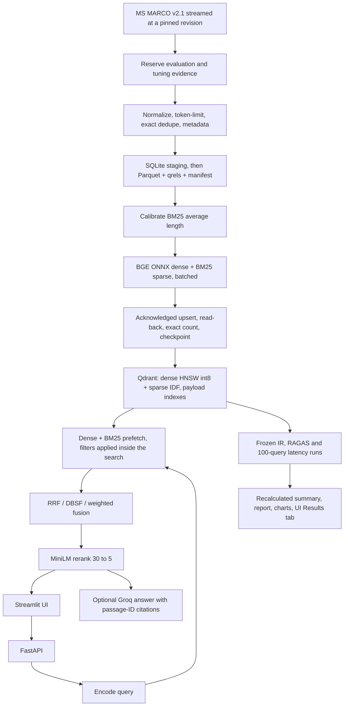

# PrecisionRAG

Team eyaaduhcaam, ADROSONIC BUILD 2026, PS1: Vector Database Design for Large-Scale Precision Retrieval in RAG Systems.

High-precision retrieval over a reproducible MS MARCO QnA v2.1 subset: BGE-small dense embeddings and BM25 sparse vectors in one Qdrant collection, configurable fusion (RRF, DBSF or weighted), MiniLM cross-encoder reranking, pre-retrieval metadata filters, live upsert/delete, a Streamlit interface, and a RAGAS + IR + latency benchmark that compares the dense baseline (Phase 1) with the hybrid stack (Phase 2). Everything runs locally on free, open-source tools; Groq's free tier is used only for answer generation and as the RAGAS judge.

The problem statement and our Round 1 proposal are in `docs/`.

## Status

| Item | State |
|---|---|
| Corpus builder, ingestion, retrieval, API, UI, evaluation code | Done, 24 tests pass |
| 100K corpus built and indexed | Done once, on one teammate's laptop (not in git; `data/` is ignored) |
| Indexing under 2 hours | **Not yet.** First CPU build took 3 h 13 min, see `reports/archive/` |
| Dense baseline latency on 100K | p95 35 ms over 100 queries (`reports/archive/`) |
| RAGAS precision/recall, Phase 1 vs Phase 2 | **Not measured yet** |
| Hybrid + rerank latency on 100K | **Not measured yet** |

Nothing in this repository claims a target is met until `python -m eval.run_all` has produced `reports/benchmark_report.md`.

## Run it

Requirements: Python 3.12, Docker Desktop (Linux containers), about 3 GB of disk, internet for the first model and dataset download. Commands below are PowerShell; on Linux/macOS use `python3.12 -m venv .venv`, `source .venv/bin/activate` and plain `python`.

### 1. Environment

```powershell
py -3.12 -m venv .venv
.\.venv\Scripts\python.exe -m pip install -r requirements-dev.txt -r requirements-eval.txt
Copy-Item .env.example .env        # add GROQ_API_KEY later; retrieval works without it
docker compose up -d qdrant        # Qdrant on http://localhost:6333, dashboard at /dashboard
```

If PowerShell refuses to activate the venv, you don't need activation: every command here calls `.\.venv\Scripts\python.exe` directly.

### 2. Quick check on a small corpus (about 10 minutes)

`config.small.yaml` builds a 2,000-passage corpus with the same 100 frozen evaluation queries. Use it to confirm everything works on your machine before committing hours to the full build.

```powershell
$env:PRAG_CONFIG = 'config.small.yaml'
.\.venv\Scripts\python.exe -m scripts.build_corpus --n 2000 --smoke
.\.venv\Scripts\python.exe -m scripts.ingest
.\.venv\Scripts\python.exe -m uvicorn app.api:app --host 127.0.0.1 --port 8000 --workers 1
```

In a second terminal (set `$env:PRAG_CONFIG` again there):

```powershell
.\.venv\Scripts\python.exe -m streamlit run ui/streamlit_app.py
```

Open http://localhost:8501. The sidebar should say **Connected** with 2,000 passages. If it says **Sample data**, the API isn't up yet: wait for "Application startup complete" in the first terminal and click **Recheck connection**. A development benchmark without the LLM judge:

```powershell
.\.venv\Scripts\python.exe -m eval.run_all --skip-ragas
```

### 3. Full 100K build (the submission index)

Same commands without `PRAG_CONFIG` (defaults to `config.yaml`, collection `msmarco_v21_100k`):

```powershell
.\.venv\Scripts\python.exe -m scripts.build_corpus --n 100000     # streams ~1 GB from Hugging Face
.\.venv\Scripts\python.exe -m scripts.ingest                        # resumable; re-run after an interruption
```

Ingestion time is the open problem (see Status). Before starting it, read "Making indexing fit in 2 hours" below.

A teammate who already has `data/` and a finished index can share them instead: copy the whole `data/` folder, then either copy `qdrant_storage/` with the container stopped, or take a snapshot from the Qdrant dashboard and restore it. Do not run `build_corpus` into a `data/` folder that already contains `manifest.json`.

### 4. Benchmark and report

```powershell
.\.venv\Scripts\python.exe -m eval.run_all --phase baseline                 # Phase 1 dense, log it first
.\.venv\Scripts\python.exe -m eval.run_all --phase core --ragas-queries 20  # dense vs hybrid+rerank
.\.venv\Scripts\python.exe -m eval.run_all                                  # all fusion/filter ablations
.\.venv\Scripts\python.exe -m scripts.recalculate --run reports/runs/<RUN_ID>
```

Each run writes `reports/runs/<RUN_ID>/` with raw rankings, per-query latency, per-query RAGAS scores, `summary.json`, `benchmark_report.md` and charts, then copies the summary and report to `reports/`. The UI's Results tab reads them. RAGAS needs `GROQ_API_KEY` in `.env`; check it with `python -m scripts.check_groq --ragas-smoke`.

### 5. Tests

```powershell
.\.venv\Scripts\python.exe -m pytest -q      # offline, deterministic fixture vectors, no model download
.\.venv\Scripts\python.exe -m scripts.smoke  # real models on 65 corpus passages in embedded Qdrant
```

## Making indexing fit in 2 hours

The first build ran at 8.6 passages/s. The component probe on the same laptop showed BGE-small on CPU at about 30 passages/s and on the RTX 3060 at about 1,900 passages/s. Options, in order of effort:

1. **Use the GPU for dense encoding** (`docs/gpu.md`): separate `.venv-gpu`, `PRAG_DENSE_DEVICE=cuda`, and a **new collection name** so CPU and CUDA embeddings are never mixed. Expected to bring the full build to well under an hour; the problem statement says CPU is "acceptable", not required.
2. **Raise `models.threads`** in `config.yaml` from 4 to the number of physical cores (8 on the 6800HS). ONNX Runtime was using a quarter of the machine.
3. **Change nothing else.** Every batch is acknowledged, read back and exactly counted before the checkpoint advances; that is deliberate and cheap compared with encoding.

Changing `models.*` or `index.*` changes the build identity, so an existing checkpoint refuses to resume; use a new `collection` name when you retune.

## Architecture



## Retrieval settings

All tunables live in `config.yaml` (and `config.small.yaml` for development).

| Component | Default | Notes |
|---|---|---|
| Dense | `BAAI/bge-small-en-v1.5` | 384-d, FastEmbed quantized ONNX, cosine |
| Sparse | `Qdrant/bm25` | k1=1.2, b=0.75; avgdl calibrated on the corpus; IDF kept by Qdrant |
| Index | HNSW M=16, ef_construct=128, int8 scalar quantization | originals on disk, rescoring on |
| Candidates | 50 dense + 50 sparse | filters are applied to both branches inside Qdrant |
| Fusion | `rrf` (k=60); `dbsf` and `weighted` (alpha=0.6) available | Qdrant 1.16 RRF uses zero-based ranks: sum 1/(k+r) |
| Reranker | `Xenova/ms-marco-MiniLM-L-6-v2` | fused top 30 to top 5; scores are logits |
| Cache | 2048 entries, 120 s TTL | query embeddings and results; bypassed during evaluation |

Weighted fusion min-max normalizes each branch independently; a document missing from one branch contributes zero there. `source` and `category` are display values, while `sources` and `categories` keep every observed membership for filtering. Live upserts write both vectors and the payload, wait for completion, verify read-back and clear the result cache. Serve the API with one worker: a lock serializes mutations with searches.

## Data

`scripts.build_corpus` streams `microsoft/ms_marco` (config v2.1, pinned revision) with a seeded bounded shuffle. It takes the evaluation and tuning queries from the validation split first, keeps every passage attached to them (so recall is never capped by sampling), then fills the cap with training passages. Passages are whitespace-normalized, hashed to a stable 63-bit id, exactly de-duplicated (memberships merged), and clipped at 510 BGE tokens; an evaluation row whose labelled positive would be clipped is skipped. Outputs: `corpus.parquet`, `eval_queries.jsonl`, `tuning_queries.jsonl`, `qrels.json`, `manifest.json` (hashes of all of them) and `checks/`.

Relevance labels come from `is_selected == 1`; the first non-empty answer is the RAGAS reference. Labels are sparse, so absolute IR numbers look low; the comparison between modes is what matters.

## Scaling to 500K

Copy `config.yaml` to `config.500k.yaml`, set `data_dir: data/500k`, `reports_dir: reports/500k`, `collection: msmarco_v21_500k`, keep the dataset revision and seed, then:

```powershell
$env:PRAG_CONFIG = 'config.500k.yaml'
.\.venv\Scripts\python.exe -m scripts.build_corpus --n 500000
.\.venv\Scripts\python.exe -m scripts.ingest
.\.venv\Scripts\python.exe -m eval.run_all
```

The 100K corpus and index are left untouched. Compare `ingest_stats.json` and the benchmark between scales.

## Layout

```
app/        config, model loading, caches, Qdrant store, retriever, Groq generator, FastAPI
scripts/    build_corpus, ingest (resumable), recalculate, smoke, check_groq, benchmark_devices, PowerShell launchers
eval/       ir_eval, latency_bench, ragas_eval, tune, run_all, metrics
ui/         Streamlit app, styles, API client, mock backend for UI work without the API
tests/      offline tests with fixture vectors
docs/       problem statement, proposal, implementation notes, GPU setup, requirements map, demo script
reports/    benchmark outputs (generated); archive/ holds the first CPU build's measurements
```

## Sources

- [MS MARCO dataset card](https://huggingface.co/datasets/microsoft/ms_marco)
- [FastEmbed supported models](https://qdrant.github.io/fastembed/examples/Supported_Models/)
- [Qdrant hybrid queries](https://qdrant.tech/documentation/concepts/hybrid-queries/) and [quantization](https://qdrant.tech/documentation/guides/quantization/)
- [RAGAS 0.2.15 context precision](https://docs.ragas.io/en/v0.2.15/concepts/metrics/available_metrics/context_precision/)
